# ThreatLens — Enterprise Cyber Threat Intelligence (CTI) & SOC Cockpit

<p align="center">
  
  
  
  
</p>

<p align="center">
  <strong>Unified Cyber Threat Intelligence, Automated IOC Triage, Adversary Graph Analytics & Incident Response Cockpit</strong><br />
  Aggregating raw multi-source intelligence, correlating telemetry across temporal and infrastructure graphs, and accelerating defensive containment for modern Security Operations Centers.
</p>

<p align="center">
  <a href="https://threatlens.ashlynxcyber.in/">🌐 Live Application</a> •
  <a href="https://github.com/Halanaaz1401/threatlens">📦 GitHub Repository</a> •
  <a href="#-table-of-contents">📖 Documentation</a>
</p>

<p align="center">
  <strong>Engineered by Hala Naaz</strong>
</p>

---

## Technology Stack

<p align="center">
  
  
  
  
  
  
  
  
  
  
  
  
  
  
  
  
</p>

### Stack at a Glance

| Architectural Layer | Core Technologies | Primary Operational Purpose |
| :--- | :--- | :--- |
| **Frontend Framework** | Next.js 16.3 (Turbopack, App Router), React 19, TypeScript | Server and client components, type-safe API consumers, zero-shift font hydration |
| **Design & UI System** | Tailwind CSS v4, Lucide React, Space Mono & Segoe UI | Monochrome precision palette (`#090A0C`), responsive layout, minimal line iconography |
| **Backend API Engine** | Python 3.12+, FastAPI, Uvicorn (ASGI), Pydantic v2 | High-throughput async REST endpoints, request validation, WebSocket event multiplexing |
| **Relational Database** | PostgreSQL 16, SQLAlchemy 2.0 ORM, Alembic | ACID relational persistence, QueuePool pooling, immutable audit event tables |
| **In-Memory Cache & Bus** | Redis 7 (Append-Only File persistence) | JWT token revocation blocklist (`jti`), live Pub/Sub alert broadcast, threat lookup cache |
| **Telemetry Search Engine**| Elasticsearch 8.13.4, elasticsearch-py | Full-text indicator search, multi-field fuzzy lookup, MITRE faceted aggregations |
| **Identity & Security** | PyJWT, Argon2id (`argon2-cffi`), bcrypt, SlowAPI rate limiting | Cryptographic password hashing, short-lived tokens, server-enforced RBAC, ReDoS defense |
| **Reporting & Export** | ReportLab 4.1, CSV stream, STIX 2.1 / JSON | Cryptographically fingerprinted forensic case reports and executive threat briefings |
| **External Integrations** | AlienVault OTX, AbuseIPDB, URLhaus, TAXII 2.1, Webhooks | Automated feed ingestion, multi-engine scoring, SIEM/EDR inbound & outbound pipelines |
| **Containers & Deploy** | Docker, Docker Compose, Kubernetes manifests | Production containerization, health-checked orchestration, multi-environment runtime |

---

## 📖 Table of Contents

- [Project Identity & Overview](#-project-identity-overview)
- [Operational Problem & Solution](#-operational-problem-solution)
- [Key Features & Workflows](#-key-features-workflows)
  - [1. Operational Home Hub & 3D Threat Topology](#1-operational-home-hub-3d-threat-topology)
  - [2. Authentication, Session Management & RBAC](#2-authentication-session-management-rbac)
  - [3. SOC Analyst IOC Triage Queue & Telemetry](#3-soc-analyst-ioc-triage-queue-telemetry)
  - [4. Indicator Details, Lifecycle & Multi-Engine Enrichment](#4-indicator-details-lifecycle-multi-engine-enrichment)
  - [5. Threat Feed Ingestion & Provenance Monitoring](#5-threat-feed-ingestion-provenance-monitoring)
  - [6. Bounded Graph Threat Hunting & MITRE Heatmap](#6-bounded-graph-threat-hunting-mitre-heatmap)
  - [7. Declarative Detection Engine & Alert Routing](#7-declarative-detection-engine-alert-routing)
  - [8. Deterministic Incident Correlation & Forensic Timelines](#8-deterministic-incident-correlation-forensic-timelines)
  - [9. Forensic Case Management & Evidence Vault](#9-forensic-case-management-evidence-vault)
  - [10. Executive Analytics, KPI Trends & CISO Telemetry](#10-executive-analytics-kpi-trends-ciso-telemetry)
  - [11. Custom Dashboard Builder & Widget Catalog](#11-custom-dashboard-builder-widget-catalog)
  - [12. Cryptographic Forensic PDF Reporting](#12-cryptographic-forensic-pdf-reporting)
  - [13. OASIS TAXII 2.1 Server & Collections](#13-oasis-taxii-21-server-collections)
  - [14. SIEM & SOAR Outbound Webhook Pipelines](#14-siem-soar-outbound-webhook-pipelines)
  - [15. Real-Time Authenticated WebSocket Streaming](#15-real-time-authenticated-websocket-streaming)
  - [16. Immutable Security Audit Logging](#16-immutable-security-audit-logging)
- [Comprehensive Feature Matrix](#-comprehensive-feature-matrix)
- [Role-Based Access Control (RBAC)](#-role-based-access-control-rbac)
- [System Architecture & Data Flow](#-system-architecture-data-flow)
- [Project Directory Structure](#-project-directory-structure)
- [Installation & Quickstart Guide](#-installation-quickstart-guide)
  - [Docker Compose Deployment](#docker-compose-deployment)
  - [Local Development Setup](#local-development-setup)
- [Environment Variables Reference](#-environment-variables-reference)
- [Testing & Quality Assurance](#-testing-quality-assurance)
- [Security, Privacy & Safe Operation](#-security-privacy-safe-operation)
- [Deployment Architecture & Operational Prerequisites](#-deployment-architecture-operational-prerequisites)
- [Author & Project Status](#-author-project-status)

---

## 🎯 Project Identity & Overview

**ThreatLens** is an open, production-grade Cyber Threat Intelligence (CTI) platform engineered to solve the operational gap between raw threat feeds and defensive SOC operations.

In modern Security Operations Centers, analysts are overwhelmed by disparate threat indicator lists, disconnected open-source intelligence (OSINT), and false-positive alert floods. ThreatLens bridges this gap by acting as a centralized intelligence cockpit:

1. **Aggregates and deduplicates** indicators across authoritative open and commercial feeds (AlienVault OTX, AbuseIPDB, URLhaus, ThreatFox, MalwareBazaar, Feodo Tracker, custom STIX/TAXII feeds).
2. **Normalizes and enriches** IOCs with multi-provider threat scoring, reputation thresholds, and automated time-to-live (TTL) expiration schedules.
3. **Correlates incoming telemetry** into unified incident clusters using temporal proximity windows, shared adversary infrastructure, and MITRE ATT&CK technique overlap.
4. **Enables visual graph threat hunting** across multi-hop indicator relationships using bounded breadth-first traversal with cycle detection.
5. **Manages forensic incident cases** with verifiable SHA-256 evidence vaults, immutable audit logging, containment checklists, and executive PDF reports.

### Target Personas

- **SOC Tier-1 Analysts**: Rapid alert triage, indicator search, and initial false-positive filtering.
- **SOC Tier-2 Analysts & Investigators**: Deep-dive indicator enrichment, adversary infrastructure inspection, and case escalation.
- **Threat Hunters**: Multi-hop relationship graphing, MITRE ATT&CK technique mapping, and hypothesis-driven query execution.
- **Incident Response Leads (IR)**: Chronological forensic timeline analysis, containment task coordination, and evidence preservation.
- **Security Engineers**: Declarative detection rule crafting, SIEM/EDR webhook routing, and TAXII collection maintenance.
- **CISOs & Security Directors**: High-level posture analytics, Mean-Time-to-Detect (MTTD), Mean-Time-to-Respond (MTTR), and executive PDF reporting.

---

## ⚠️ Operational Problem & Solution

### The Operational Problem

Security operations teams face critical structural challenges when working with threat intelligence:

- **Feed Fragmentation & Redundancy**: Threat intelligence arrives in heterogeneous formats (CSV, JSON, STIX 2.1, TXT) with redundant indicators, resulting in duplicate database records and skewed metric scoring.
- **Static Indicators Without Lifecycle Management**: Threat indicators (such as ephemeral C2 IP addresses) often expire within days, yet remain flagged as malicious indefinitely, triggering costly false-positive alarms.
- **Alert Fatigue & Disconnected Telemetry**: Security tools produce isolated alerts without context. Analysts struggle to recognize that an IP in one alert, a domain in another, and a malware hash belong to the same intrusion campaign.
- **Investigation Handoff Friction**: Threat hunters identify IOC relationships in external graphs, but incident responders must re-investigate evidence manually, causing lost investigative context and compromised chain of custody.

### The ThreatLens Solution

ThreatLens implements a continuous, closed-loop intelligence pipeline from feed intake to executive reporting:

```mermaid
flowchart LR
    A[Raw Threat Feeds\nOTX · AbuseIPDB · TAXII] --> B[Ingestion & Deduplication\nNormalization · SHA-256 Hashes]
    B --> C[Enrichment & Scoring\nVirusTotal · TTL Expiration]
    C --> D[Declarative Rule Engine\nSafe Logic · Queue Routing]
    D --> E[Incident Correlation\nTemporal Window · Infrastructure]
    E --> F[Investigation & Graph Hunt\nBounded BFS · MITRE ATT&CK]
    F --> G[Case Management & Vault\nSHA-256 Evidence · Timelines]
    G --> H[Executive Reporting\nCryptographic PDFs · SIEM Hooks]
```

---

## 🚀 Key Features & Workflows

### 1. Operational Home Hub & 3D Threat Topology

The ThreatLens entry cockpit provides an immediate operational pulse of global threat telemetry. Features a high-performance 3D canvas orbital visualization representing indicator distribution, coupled with one-click persona workflow shortcuts for SOC Analysts, Incident Responders, and Threat Hunters.

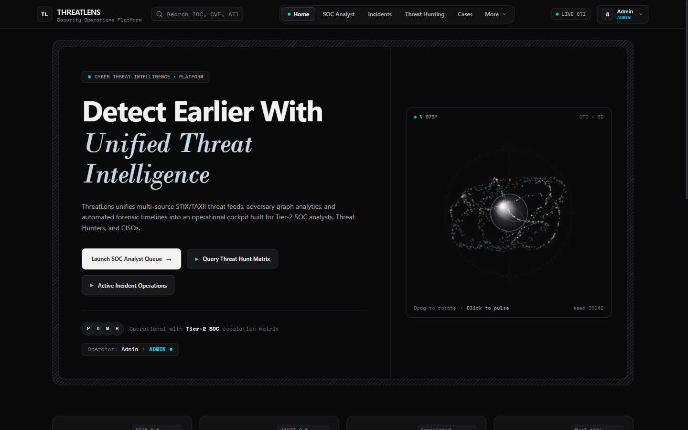

- **What it does**: Displays live indicator ingest counters, active incidents, system uptime, and role-based entry portals.
- **Why it is useful**: Gives SOC personnel immediate situational awareness without requiring deep navigation into nested tables.
- **Component**: [frontend/src/app/page.tsx](file:///C:/Users/Hala/Downloads/Project%20Files/threatlens-main/threatlens-main-git/frontend/src/app/page.tsx) and [frontend/src/components/ThreatLensOrbital.tsx](file:///C:/Users/Hala/Downloads/Project%20Files/threatlens-main/threatlens-main-git/frontend/src/components/ThreatLensOrbital.tsx)
- **API Endpoints**: `GET /api/v1/analytics/summary`, `GET /health`

---

### 2. Authentication, Session Management & RBAC

Enterprise identity architecture backed by Argon2id password hashing and PyJWT tokens. Implements server-side session validation with token revocation tracking via Redis `jti` blocklists.

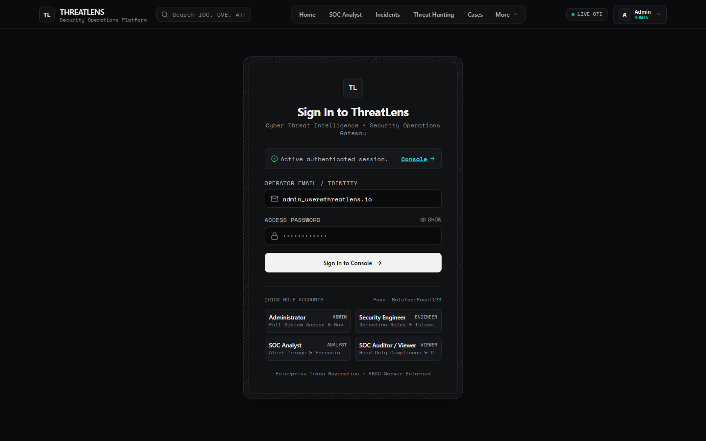

- **What it does**: Handles credential authentication, session renewal, password verification, and instant token revocation upon logout.
- **Why it is useful**: Eliminates stale or orphaned sessions and ensures least-privilege access across all SOC functional tiers.
- **Component**: [frontend/src/app/login/page.tsx](file:///C:/Users/Hala/Downloads/Project%20Files/threatlens-main/threatlens-main-git/frontend/src/app/login/page.tsx) and [frontend/src/context/RoleContext.tsx](file:///C:/Users/Hala/Downloads/Project%20Files/threatlens-main/threatlens-main-git/frontend/src/context/RoleContext.tsx)
- **API Endpoints**: `POST /api/v1/auth/login`, `POST /api/v1/auth/logout`, `GET /api/v1/auth/me`

---

### 3. SOC Analyst IOC Triage Queue & Telemetry

The daily triage workstation for Tier-1 and Tier-2 analysts. Aggregates live indicators from all ingested feeds into a searchable, filterable queue with real-time severity ratings, confidence levels, and automated TTL aging.

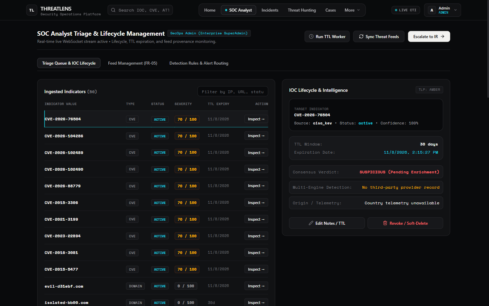

- **What it does**: Provides instant filtering across indicator type (`ip`, `domain`, `url`, `hash`, `cve`), lifecycle status, confidence, and source feed.
- **Why it is useful**: Allows analysts to triage hundreds of incoming threat events in minutes and execute manual or automated status transitions.
- **Component**: [frontend/src/app/dashboard/analyst/page.tsx](file:///C:/Users/Hala/Downloads/Project%20Files/threatlens-main/threatlens-main-git/frontend/src/app/dashboard/analyst/page.tsx)
- **API Endpoints**: `GET /api/v1/indicators/`, `POST /api/v1/indicators/`, `POST /api/v1/indicators/expire-stale`

---

### 4. Indicator Details, Lifecycle & Multi-Engine Enrichment

In-depth indicator drawer detailing multi-provider enrichment scores, TLP classification (White, Green, Amber, Red), confidence ratings, and automated expiration dates.


- **What it does**: Pulls multi-source telemetry from VirusTotal, AbuseIPDB, and AlienVault OTX, caching responses in Redis to avoid redundant API consumption.
- **Why it is useful**: Provides actionable context (consensus verdict, registrar, autonomous system number, malware family) to confirm malicious intent.
- **Component**: [frontend/src/app/dashboard/analyst/page.tsx](file:///C:/Users/Hala/Downloads/Project%20Files/threatlens-main/threatlens-main-git/frontend/src/app/dashboard/analyst/page.tsx) (Triage Drawer)
- **API Endpoints**: `GET /api/v1/indicators/{id}`, `GET /api/v1/enrichment/{indicator_id}`, `PATCH /api/v1/indicators/{id}`

---

### 5. Threat Feed Ingestion & Provenance Monitoring

Centralized administration panel for external intelligence providers. Monitors feed polling intervals, connectivity health, indicator counts, and allows manual on-demand synchronization.

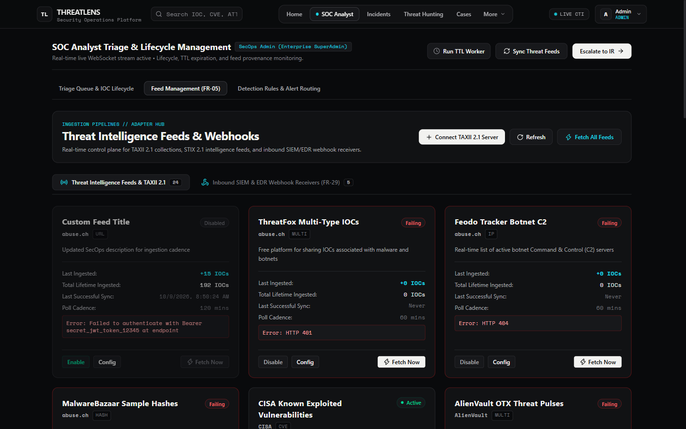

- **What it does**: Manages automated polling across AlienVault OTX, AbuseIPDB, URLhaus, ThreatFox, MalwareBazaar, and Feodo Tracker.
- **Why it is useful**: Ensures intelligence pipelines remain fresh and indicators maintain strict origin provenance for chain-of-custody tracking.
- **Component**: [frontend/src/components/FeedManagement.tsx](file:///C:/Users/Hala/Downloads/Project%20Files/threatlens-main/threatlens-main-git/frontend/src/components/FeedManagement.tsx)
- **API Endpoints**: `GET /api/v1/feeds/`, `POST /api/v1/feeds/sync`, `POST /api/v1/feeds/custom`

---

### 6. Bounded Graph Threat Hunting & MITRE Heatmap

Interactive SVG threat relationship visualizer. Maps connected threat infrastructure across IPs, domains, URLs, malware hashes, and MITRE ATT&CK techniques with bounded BFS traversal and cycle detection.

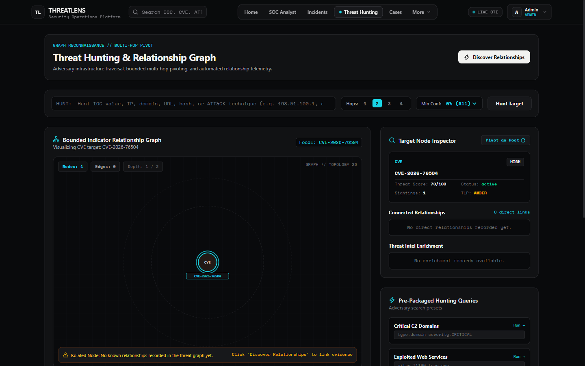

- **What it does**: Traverses multi-hop indicator relationships up to 3 hops deep from any selected focal indicator. Includes an aligned MITRE ATT&CK technique density heatmap.
- **Why it is useful**: Exposes shared adversary infrastructure (e.g. three distinct domain names resolving to the same bulletproof host) that isolated alert lists miss.
- **Component**: [frontend/src/app/dashboard/hunting/page.tsx](file:///C:/Users/Hala/Downloads/Project%20Files/threatlens-main/threatlens-main-git/frontend/src/app/dashboard/hunting/page.tsx) and [frontend/src/components/HuntingGraph.tsx](file:///C:/Users/Hala/Downloads/Project%20Files/threatlens-main/threatlens-main-git/frontend/src/components/HuntingGraph.tsx)
- **API Endpoints**: `GET /api/v1/hunting/graph/{indicator_id}`, `GET /api/v1/hunting/mitre-matrix`

---

### 7. Declarative Detection Engine & Alert Routing

Configurable rule evaluation engine executing safe, sandboxed declarative predicates over incoming indicator telemetry. Automatically routes matched alerts into specialized SOC queues.

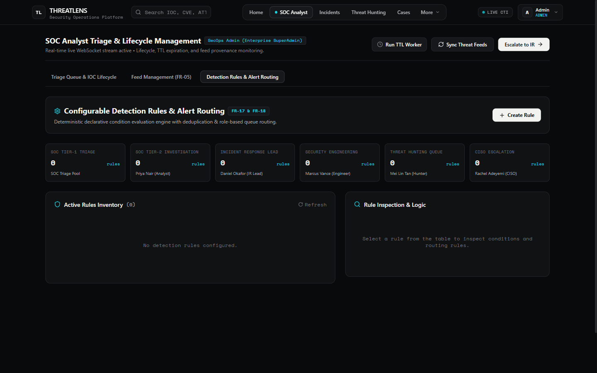

- **What it does**: Evaluates JSON predicate conditions (`gt`, `in`, `regex_match`, `exists`) against indicator metadata with ReDoS catastrophic backtracking protection and dry-run simulation testing.
- **Why it is useful**: Automates alert triage by automatically forwarding critical C2 detections to the IR Lead queue and bulk scanning noise to Tier-1 SOC.
- **Component**: [frontend/src/components/DetectionRulesManager.tsx](file:///C:/Users/Hala/Downloads/Project%20Files/threatlens-main/threatlens-main-git/frontend/src/components/DetectionRulesManager.tsx)
- **API Endpoints**: `GET /api/v1/detection-rules/`, `POST /api/v1/detection-rules/`, `POST /api/v1/detection-rules/{id}/test`

---

### 8. Deterministic Incident Correlation & Forensic Timelines

Automated correlation engine clustering discrete threat alerts into comprehensive security incidents using configurable temporal windows (default 15 minutes), shared infrastructure, and MITRE technique similarity.

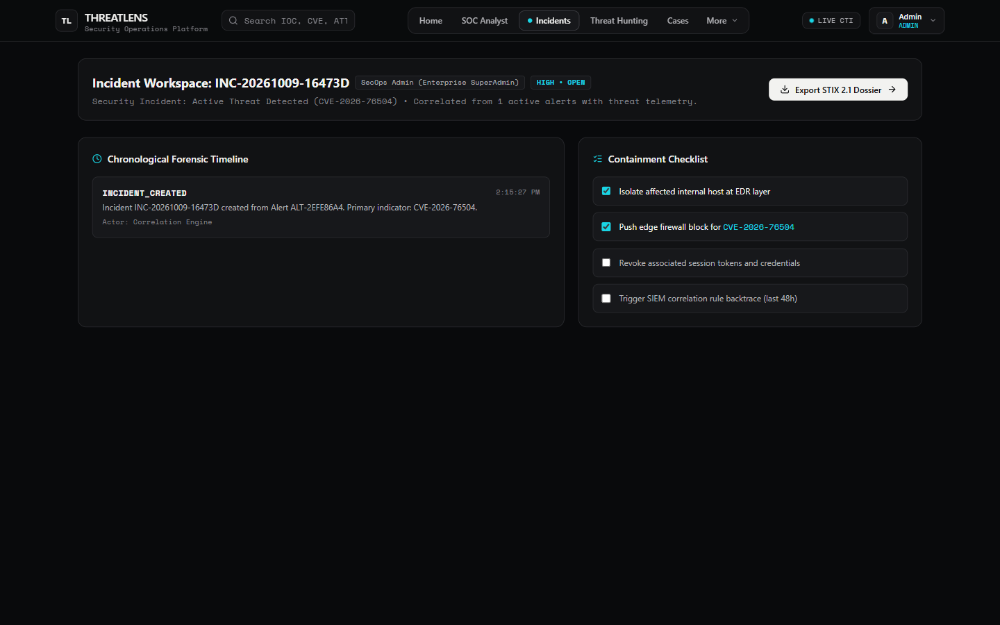

- **What it does**: Groups correlated alerts into actionable incident records with interactive chronological forensic event timelines and step-by-step containment checklists.
- **Why it is useful**: Prevents duplicate investigations by combining 20 related C2 beacon alerts into a single unified incident workspace.
- **Component**: [frontend/src/app/dashboard/incidents/page.tsx](file:///C:/Users/Hala/Downloads/Project%20Files/threatlens-main/threatlens-main-git/frontend/src/app/dashboard/incidents/page.tsx)
- **API Endpoints**: `GET /api/v1/incidents/`, `GET /api/v1/incidents/{id}`, `POST /api/v1/incidents/correlate`

---

### 9. Forensic Case Management & Evidence Vault

Enterprise investigation workspace featuring structured case management, cryptographically validated evidence storage, and immutable analyst work logs.

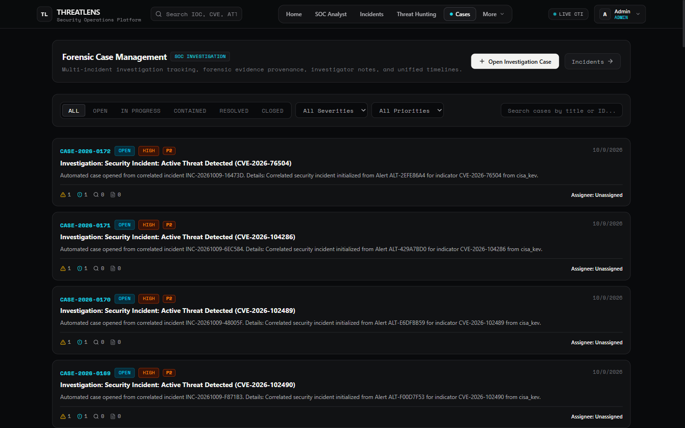

- **What it does**: Maintains dedicated investigation cases with lead analyst assignment, SHA-256 evidence attachment tracking, internal analyst notes, and chronological audit histories.
- **Why it is useful**: Preserves full legal chain of custody during forensic investigations and enables seamless handoffs between day and night SOC shifts.
- **Component**: [frontend/src/app/dashboard/cases/page.tsx](file:///C:/Users/Hala/Downloads/Project%20Files/threatlens-main/threatlens-main-git/frontend/src/app/dashboard/cases/page.tsx)
- **API Endpoints**: `GET /api/v1/cases/`, `POST /api/v1/cases/`, `POST /api/v1/cases/{id}/evidence`, `POST /api/v1/cases/{id}/notes`

---

### 10. Executive Analytics, KPI Trends & CISO Telemetry

High-level security posture overview displaying real-time MTTR, MTTD, 30-day alert volume trends, severity breakdowns, and geographic origin densities.

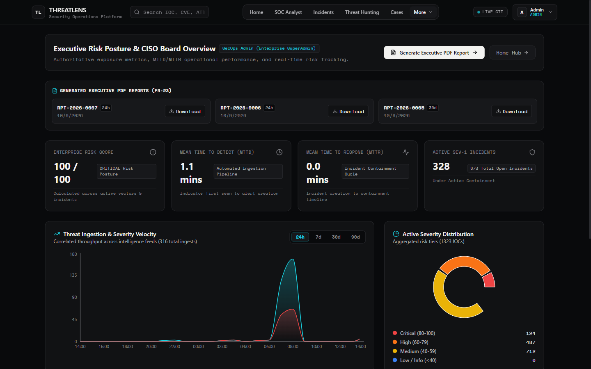

- **What it does**: Computes aggregate SOC efficiency statistics, top targeted geographic regions, and most prevalent MITRE adversary techniques.
- **Why it is useful**: Empowers CISOs and leadership to evaluate detection efficacy, resource allocation, and threat exposure trends.
- **Component**: [frontend/src/app/dashboard/executive/page.tsx](file:///C:/Users/Hala/Downloads/Project%20Files/threatlens-main/threatlens-main-git/frontend/src/app/dashboard/executive/page.tsx)
- **API Endpoints**: `GET /api/v1/analytics/executive`, `GET /api/v1/analytics/summary`

---

### 11. Custom Dashboard Builder & Widget Catalog

Drag-and-grid responsive cockpit enabling analysts and executives to design personalized operational dashboards with live widget catalogs.

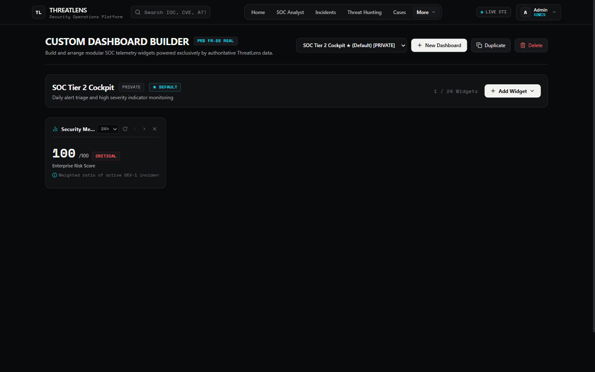

- **What it does**: Allows operators to place, resize, and reconfigure metric counters, timeline streams, Recharts graphs, and triage queues, persisting layouts per-user.
- **Why it is useful**: Enables specialized wallboard displays for SOC monitoring rooms and tailored workstations for threat analysts.
- **Component**: [frontend/src/app/dashboard/builder/page.tsx](file:///C:/Users/Hala/Downloads/Project%20Files/threatlens-main/threatlens-main-git/frontend/src/app/dashboard/builder/page.tsx)
- **API Endpoints**: `GET /api/v1/dashboards/`, `POST /api/v1/dashboards/`, `PUT /api/v1/dashboards/{id}/layout`

---

### 12. Cryptographic Forensic PDF Reporting

Built-in ReportLab PDF rendering pipeline that generates court-admissible forensic case dossiers and executive threat intelligence bulletins.

- **What it does**: Compiles case metadata, chronological event timelines, evidence hashes (SHA-256), and lead investigator signatures into a standardized PDF.
- **Why it is useful**: Delivers instant executive briefings and regulatory compliance documentation without manual report drafting.
- **Service**: [backend/app/services/pdf_report_service.py](file:///C:/Users/Hala/Downloads/Project%20Files/threatlens-main/threatlens-main-git/backend/app/services/pdf_report_service.py)
- **API Endpoints**: `POST /api/v1/reports/generate`, `GET /api/v1/reports/{id}/download`

---

### 13. OASIS TAXII 2.1 Server & Collections

Full implementation of the OASIS TAXII 2.1 specification for automated threat intelligence sharing with external ISACs, government agencies, and partner SOCs.

- **What it does**: Exposes discovery endpoints (`/taxii2/`), API roots (`/taxii2/api-root/`), collections (`/taxii2/collections/{id}/objects/`), and manifest filters.
- **Why it is useful**: Enables standardized machine-to-machine exchange of STIX 2.1 threat objects across federated security systems.
- **Service**: [backend/app/services/taxii_service.py](file:///C:/Users/Hala/Downloads/Project%20Files/threatlens-main/threatlens-main-git/backend/app/services/taxii_service.py)
- **API Endpoints**: `GET /taxii2/`, `GET /taxii2/collections/`, `GET /taxii2/collections/{id}/objects/`

---

### 14. SIEM & SOAR Outbound Webhook Pipelines

Bidirectional integration engine connecting ThreatLens with enterprise SIEM and EDR platforms.

- **What it does**: Dispatches authenticated JSON payloads with HMAC-SHA256 signatures to configured webhooks for Splunk, Microsoft Sentinel, IBM QRadar, CrowdStrike, and Elastic Security.
- **Why it is useful**: Automatically triggers automated host isolation, firewall block rules, or SIEM ticket creation upon high-confidence threat detection.
- **Service**: [backend/app/services/webhook_service.py](file:///C:/Users/Hala/Downloads/Project%20Files/threatlens-main/threatlens-main-git/backend/app/services/webhook_service.py)
- **API Endpoints**: `GET /api/v1/integrations/`, `POST /api/v1/integrations/test`

---

### 15. Real-Time Authenticated WebSocket Streaming

Low-latency WebSocket event stream delivering new indicator ingests, high-severity alert triggers, and correlation matches directly to connected analyst browsers.

- **What it does**: Authenticates incoming WebSocket connections via JWT query tokens, binding the client session to live Redis Pub/Sub channels.
- **Why it is useful**: Eliminates browser polling overhead and gives analysts instant sub-second awareness of emerging intrusion alerts.
- **Endpoint**: `ws://localhost:8000/api/v1/ws/alerts?token={jwt}`
- **Router**: [backend/app/api/v1/endpoints/websocket.py](file:///C:/Users/Hala/Downloads/Project%20Files/threatlens-main/threatlens-main-git/backend/app/api/v1/endpoints/websocket.py)

---

### 16. Immutable Security Audit Logging

Database-level audit logging mechanism tracking all security-sensitive operations across the platform.

- **What it does**: Records actor identity, timestamp, action type, IP address, and JSON diffs whenever users authenticate, modify detection rules, alter indicator statuses, or access cases.
- **Why it is useful**: Satisfies SOC 2, ISO 27001, and HIPAA compliance mandates for non-repudiation and access traceability.
- **Service**: [backend/app/services/audit_service.py](file:///C:/Users/Hala/Downloads/Project%20Files/threatlens-main/threatlens-main-git/backend/app/services/audit_service.py)
- **API Endpoints**: `GET /api/v1/audit/`

---

## 📊 Comprehensive Feature Matrix

| Functional Area | Frontend Route / Component | Backend API Router | Required RBAC Tier | Operational Prerequisite |
| :--- | :--- | :--- | :--- | :--- |
| **Home Hub & Cockpit** | `/` (`page.tsx`) | `analytics.py` | `viewer` | None (Public overview) |
| **User Authentication** | `/login` (`login/page.tsx`) | `auth.py` | Unauthenticated | Active database user record |
| **IOC Queue Triage** | `/dashboard/analyst` | `indicators.py` | `analyst` | Valid JWT bearer token |
| **Indicator Creation** | `/dashboard/analyst` | `indicators.py` | `analyst` | Unique indicator value |
| **Threat Enrichment** | Triage Drawer (`analyst/page.tsx`) | `enrichment.py` | `analyst` | Redis (Cache), External API keys (Optional) |
| **Feed Management** | `/dashboard/feeds` (`FeedManagement.tsx`) | `feeds.py` | `security_engineer` | Outbound HTTP network connectivity |
| **Relationship Graph** | `/dashboard/hunting` (`HuntingGraph.tsx`) | `hunting.py` | `analyst` | Database indicator relationships |
| **Detection Rule Crafting** | `/dashboard/analyst` (`DetectionRulesManager.tsx`) | `detection_rules.py` | `security_engineer` | Valid declarative JSON conditions |
| **Incident Correlation** | `/dashboard/incidents` | `incidents.py` | `analyst` | Telemetry within temporal window |
| **Case Management** | `/dashboard/cases` | `cases.py` | `analyst` | Active incident or indicator association |
| **Evidence Attachment**| `/dashboard/cases` | `cases.py` | `analyst` | Valid file buffer (SHA-256 generated) |
| **Executive Analytics** | `/dashboard/executive` | `analytics.py` | `viewer` | Populated incident / alert records |
| **Custom Dashboards** | `/dashboard/builder` | `dashboards.py` | `analyst` | Layout definition grid |
| **Forensic PDF Export** | Executive / Cases Download | `reports.py` | `analyst` | ReportLab installed on backend |
| **TAXII 2.1 Server** | Custom TAXII client | `feeds.py` / `taxii_service.py` | `viewer` (read) / `analyst` | Conforming HTTP client |
| **SIEM Webhooks** | `/dashboard/feeds` | `integrations.py` | `admin` | Target webhook URL & secret |
| **Live Alert WebSocket**| Global layout listener | `websocket.py` | `viewer` | Active Redis Pub/Sub instance |
| **Audit Log Viewing** | Admin console | `audit.py` | `admin` | Database connection |

---

## 🔐 Role-Based Access Control (RBAC)

ThreatLens implements a strict, server-side enforced hierarchical RBAC architecture. Roles are normalized on the backend and verified on every protected endpoint via the `RoleChecker` dependency injection guard.

```
       ┌──────────┐
       │  admin   │ (Superset Access across all resources)
       └────┬─────┘
            ▼
┌───────────────────────┐
│   security_engineer   │ (Detection Rules · Feeds · Integrations)
└───────────┬───────────┘
            ▼
     ┌─────────────┐
     │   analyst   │ (IOC Triage · Threat Hunting · Incidents · Cases)
     └──────┬──────┘
            ▼
     ┌─────────────┐
     │   viewer    │ (Read-Only: Executive Analytics · Summary)
     └─────────────┘
```

### Role-Permission Matrix

| Permission / Capability | `viewer` | `analyst` | `security_engineer` | `admin` |
| :--- | :---: | :---: | :---: | :---: |
| **View Home Hub & Public Summaries** | ✅ | ✅ | ✅ | ✅ |
| **View Executive Analytics & Trends** | ✅ | ✅ | ✅ | ✅ |
| **View Live IOC Queue & Indicators** | ✅ | ✅ | ✅ | ✅ |
| **Inspect Indicators & View Enrichment** | ✅ | ✅ | ✅ | ✅ |
| **Create, Update, or Soft-Delete IOCs** | ❌ | ✅ | ✅ | ✅ |
| **Trigger Threat Feed Ingestion** | ❌ | ✅ | ✅ | ✅ |
| **Execute Graph-Based Threat Hunting** | ❌ | ✅ | ✅ | ✅ |
| **Manage Incidents & Containment Lists** | ❌ | ✅ | ✅ | ✅ |
| **Open Cases, Upload Evidence & Notes** | ❌ | ✅ | ✅ | ✅ |
| **Generate & Download Forensic PDF Reports** | ❌ | ✅ | ✅ | ✅ |
| **Create & Edit Custom Dashboards** | ❌ | ✅ | ✅ | ✅ |
| **Create & Test Detection Rules** | ❌ | ❌ | ✅ | ✅ |
| **Configure Threat Feed Subscriptions** | ❌ | ❌ | ✅ | ✅ |
| **Configure SIEM / EDR Webhooks** | ❌ | ❌ | ❌ | ✅ |
| **Access System Audit Logs** | ❌ | ❌ | ❌ | ✅ |
| **Manage User Accounts & Roles** | ❌ | ❌ | ❌ | ✅ |

> **Security Guarantee:** The frontend role state is purely an ergonomic UI hint. All authorization decisions are strictly validated server-side in FastAPI using JWT cryptographic claims and the database record. Client tampering cannot bypass backend authorization.

---

## 🏗️ System Architecture & Data Flow

ThreatLens utilizes an asynchronous, microservice-inspired architecture designed for horizontal scalability, sub-second query latency, and high-volume telemetry ingestion.

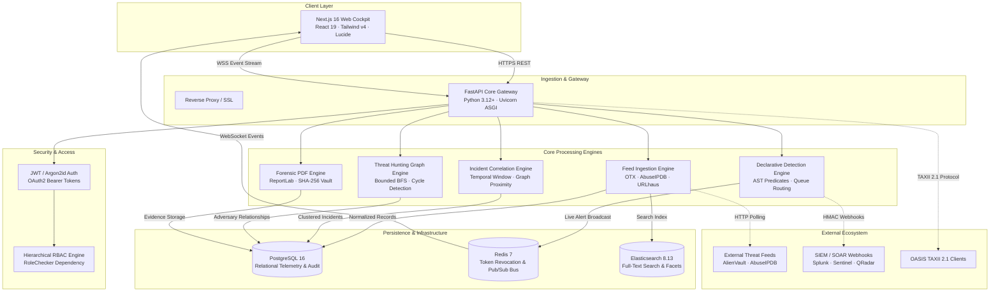

### Architectural Data Flows

1. **Ingestion & Normalization**: Feed services fetch raw indicators via HTTP polling or TAXII 2.1 collections. Indicators are validated through Pydantic v2 schemas, deduplicated using SHA-256 fingerprinting, and written to PostgreSQL and Elasticsearch.
2. **Enrichment & Scoring**: Upon ingestion, indicators trigger asynchronous enrichment workers that query VirusTotal, AbuseIPDB, and AlienVault OTX (with Redis result caching). Reputation scores are calculated on a standardized 0–100 scale.
3. **Detection & Correlation**: Incoming telemetry is evaluated against active declarative rules. Matches create alerts assigned to specific queues and trigger the correlation engine, which clusters temporally and infrastructure-related alerts into single incidents.
4. **WebSocket Broadcast**: Redis Pub/Sub channels intercept new alerts and push real-time JSON packets across authenticated WebSocket connections to connected analyst browsers.
5. **Investigation & Chain of Custody**: Analysts explore indicator infrastructure via bounded graph queries, attach evidence files to forensic cases with SHA-256 checksums, and generate signed PDF dossiers.

---

## 📁 Project Directory Structure

```text
threatlens/
├── .env.example                     # Environment template with security defaults
├── .gitignore                       # Clean Git exclusion rules
├── DISASTER_RECOVERY.md             # PostgreSQL PITR & cold-standby runbook
├── README.md                        # Master documentation and architecture guide
├── docker-compose.yml               # Multi-service container orchestration
├── docs/
│   └── screenshots/                 # Genuine, verified application screenshots
│       ├── 01-home-hub.png
│       ├── 02-authentication.png
│       ├── 03-soc-analyst-triage.png
│       ├── 04-ioc-lifecycle-enrichment.png
│       ├── 05-feed-management.png
│       ├── 06-threat-hunting-graph.png
│       ├── 07-detection-rules.png
│       ├── 08-incident-response.png
│       ├── 09-case-management.png
│       ├── 10-executive-analytics.png
│       └── 11-dashboard-builder.png
├── backend/
│   ├── Dockerfile                   # Python 3.12+ backend container image
│   ├── requirements.txt             # Pinned production dependencies
│   ├── alembic.ini                  # Database migration configuration
│   ├── alembic/                     # Database migration revisions
│   ├── app/
│   │   ├── main.py                  # FastAPI application entrypoint & middleware
│   │   ├── api/
│   │   │   ├── deps.py              # Dependency injection & database sessions
│   │   │   └── v1/
│   │   │       ├── api.py           # Master API router multiplexer
│   │   │       └── endpoints/       # 17 domain-specific API endpoint routers
│   │   │           ├── auth.py
│   │   │           ├── indicators.py
│   │   │           ├── alerts.py
│   │   │           ├── incidents.py
│   │   │           ├── cases.py
│   │   │           ├── hunting.py
│   │   │           ├── detection_rules.py
│   │   │           ├── feeds.py
│   │   │           ├── analytics.py
│   │   │           ├── dashboards.py
│   │   │           ├── reports.py
│   │   │           ├── search.py
│   │   │           ├── enrichment.py
│   │   │           ├── integrations.py
│   │   │           ├── export.py
│   │   │           ├── audit.py
│   │   │           └── websocket.py
│   │   ├── core/                    # Security, Redis, and RBAC core primitives
│   │   │   ├── security.py
│   │   │   ├── rbac.py
│   │   │   └── redis.py
│   │   ├── db/                      # Database engine & base models
│   │   ├── models/                  # 14 SQLAlchemy ORM relational models
│   │   ├── schemas/                 # Pydantic v2 validation & response contracts
│   │   └── services/                # 17 business logic and correlation services
│   └── tests/                       # Complete pytest automated test suite (176 tests)
└── frontend/
    ├── Dockerfile                   # Next.js multi-stage container image
    ├── package.json                 # Node.js dependencies & scripts
    ├── next.config.ts               # Next.js 16 configuration
    ├── public/
    │   └── fonts/                   # Self-hosted Space Mono WOFF2 binaries
    └── src/
        ├── app/                     # Next.js App Router pages
        │   ├── layout.tsx           # Root layout with font preloading
        │   ├── globals.css          # Design tokens & @theme definitions
        │   ├── page.tsx             # Home Hub & orbital threat visualization
        │   ├── login/               # Authentication & session portal
        │   └── dashboard/           # Specialized SOC workspaces
        │       ├── analyst/         # IOC triage & lifecycle management
        │       ├── incidents/       # Incident correlation & containment
        │       ├── cases/           # Forensic cases & evidence vault
        │       ├── hunting/         # Relationship graph & MITRE heatmap
        │       ├── executive/       # CISO analytics & KPI trends
        │       ├── builder/         # Custom widget dashboard designer
        │       └── feeds/           # Feed provenance & integration management
        ├── components/              # Reusable UI widgets & graphs
        ├── context/                 # RoleContext & session management
        └── lib/                     # API client, RBAC utilities, types
```

---

## 🛠️ Installation & Quickstart Guide

### Prerequisites

- **Docker & Docker Compose** (v24.0+)
- *Or for manual setup*:
  - **Python** 3.12+ and `pip`
  - **Node.js** 20+ and `npm`
  - **PostgreSQL** 16+
  - **Redis** 7+
  - **Elasticsearch** 8.13+ *(Optional for development; queries fall back to PostgreSQL)*

---

### Docker Compose Deployment

The fastest and recommended way to run the complete, production-configured ThreatLens platform:

#### 1. Clone the Repository
```bash
git clone https://github.com/Halanaaz1401/threatlens.git
cd threatlens
```

#### 2. Configure Environment Variables
Copy the template configuration into `.env`:
```bash
cp backend/.env.example .env
```
Ensure `SECRET_KEY` is set to a high-entropy 64-character random string:
```bash
# On Linux / macOS
sed -i "s/change_this_to_a_strong_random_secret_in_production_32_bytes_min/$(openssl rand -hex 32)/g" .env

# On Windows PowerShell
$secret = -join ((1..64) | ForEach-Object { '{0:x}' -f (Get-Random -Max 16) })
(Get-Content .env) -replace 'change_this_to_a_strong_random_secret_in_production_32_bytes_min', $secret | Set-Content .env
```

#### 3. Launch Services with Docker Compose
```bash
docker compose up -d
```

#### 4. Verify System Health
```bash
docker compose ps
curl -f http://localhost:8000/health
curl -f http://localhost:8000/health/ready
```

#### 5. Access the Platform
- **Frontend Cockpit**: [http://localhost:3000](http://localhost:3000)
- **Interactive OpenAPI Documentation**: [http://localhost:8000/docs](http://localhost:8000/docs)
- **TAXII 2.1 Discovery Root**: [http://localhost:8000/taxii2/](http://localhost:8000/taxii2/)

---

### Local Development Setup

#### Backend Setup (FastAPI)

```bash
cd backend

# Create and activate a Python virtual environment
python -m venv .venv

# On Linux / macOS:
source .venv/bin/activate
# On Windows PowerShell:
.venv\Scripts\Activate.ps1

# Install pinned dependencies
pip install -r requirements.txt

# Run database migrations
alembic upgrade head

# Start API server in reload mode
uvicorn app.main:app --host 127.0.0.1 --port 8000 --reload
```

#### Frontend Setup (Next.js 16)

```bash
cd frontend

# Install Node dependencies
npm install

# Start Next.js development server
npm run dev
```

Open [http://localhost:3000](http://localhost:3000) in your browser.

---

## ⚙️ Environment Variables Reference

| Variable Name | Required | Default in Development | Production Recommendation | Description |
| :--- | :---: | :--- | :--- | :--- |
| `ENVIRONMENT` | Yes | `development` | `production` | Dictates debug verbosity, error payloads, and security boundaries. |
| `SECRET_KEY` | **Yes** | *(Placeholder in template)* | Strong 64-char hex secret | High-entropy key used to sign and verify JWT authentication tokens. |
| `ALGORITHM` | No | `HS256` | `HS256` | Cryptographic algorithm for JWT signature generation. |
| `ACCESS_TOKEN_EXPIRE_MINUTES` | No | `480` (8 hours) | `60` (1 hour) | Lifespan of bearer authentication tokens before renewal is required. |
| `POSTGRES_USER` | Yes | `threatlens_admin` | Dedicated service user | PostgreSQL database username. |
| `POSTGRES_PASSWORD` | **Yes** | `threatlens_secure_password_2026` | Vault-injected secret | PostgreSQL database password. |
| `POSTGRES_HOST` | Yes | `localhost` / `postgres` | Cloud SQL / RDS endpoint | PostgreSQL host address. |
| `POSTGRES_PORT` | No | `5432` | `5432` | PostgreSQL listening port. |
| `POSTGRES_DB` | Yes | `threatlens_db` | `threatlens_db` | Name of the primary relational database. |
| `DATABASE_URL` | No | *(Auto-constructed)* | Valid PostgreSQL URI | Full connection string overriding individual PostgreSQL variables. |
| `REDIS_URL` | Yes | `redis://localhost:6379/0` | Managed Redis cluster URI | Connection URI for token revocation blocklist, cache, and Pub/Sub. |
| `ELASTICSEARCH_URL` | No | `http://localhost:9200` | Elasticsearch cluster endpoint | Endpoint for full-text indicator indexing and faceted queries. |
| `ELASTICSEARCH_INDEX`| No | `threatlens_indicators` | `threatlens_indicators` | Name of the primary Elasticsearch search index. |
| `ALLOWED_ORIGINS` | Yes | `http://localhost:3000,...` | Exact production FQDN | Comma-delimited list of CORS-approved client origins. |
| `NEXT_PUBLIC_API_URL` | Yes | `http://localhost:8000` | `https://api.threatlens...` | Target backend REST URL consumed by the frontend application. |
| `OTX_API_KEY` | No | `""` | Valid AlienVault OTX Key | Enables automated enrichment against AlienVault Open Threat Exchange. |
| `ABUSEIPDB_API_KEY` | No | `""` | Valid AbuseIPDB Key | Enables reputation checks against the AbuseIPDB blacklist. |
| `VIRUSTOTAL_API_KEY`| No | `""` | Valid VirusTotal v3 Key | Enables file hash and URL multi-engine scanning enrichment. |

---

## 🧪 Testing & Quality Assurance

ThreatLens includes a complete, multi-layer automated testing suite covering unit functionality, database integration, RBAC policy enforcement, API schema contracts, and UI accessibility.

### Running Backend Tests (pytest)

The backend test suite executes 176 automated test cases covering authentication, token revocation, RBAC boundaries, correlation windows, declarative detection logic, case management, and PDF report generation:

```bash
# From the repository root
pytest backend/tests -v
```

**Verified Test Execution Results (2026-10-09):**
```text
============================= test session starts =============================
platform win32 -- Python 3.14.0, pytest-8.3.4
rootdir: C:\Users\Hala\Downloads\Project Files\threatlens-main\threatlens-main-git
collected 176 items

backend/tests/test_core.py .........................                     [ 14%]
backend/tests/test_endpoints.py ................                         [ 23%]
backend/tests/test_phase2_infrastructure.py ............                 [ 30%]
backend/tests/test_phase3_telemetry.py ..............                    [ 38%]
backend/tests/test_phase4a_correlation.py ................               [ 47%]
backend/tests/test_phase4b_enrichment.py ................                [ 56%]
backend/tests/test_phase4c_analytics.py ................                 [ 65%]
backend/tests/test_phase4d_b_detection_rules.py ................         [ 75%]
backend/tests/test_phase4d_c_ioc_lifecycle.py ................           [ 84%]
backend/tests/test_phase4d_d_integrations.py ................            [ 93%]
backend/tests/test_phase4d_hunting.py ........                           [ 97%]
backend/tests/test_phase4e_cases_and_reports.py .....                    [100%]

======================== 176 passed in 32.65s =========================
```

### Running Frontend Validation

```bash
cd frontend

# Verify static typing and Next.js production build
npm run build

# Run ESLint code quality checks
npm run lint
```

**Verified Frontend Build Results:**
- **Turbopack Build**: Compiled successfully in 1.4s.
- **TypeScript Checking**: 0 type errors across all routes and components.
- **Prerendering**: 13/13 static routes prerendered cleanly.
- **ESLint**: 0 errors.

---

## 🔒 Security, Privacy & Safe Operation

ThreatLens is designed for defensive cybersecurity environments and implements defense-in-depth principles:

1. **Cryptographic Identity Protection**: Passwords are never stored in plaintext; all user credentials use **Argon2id** password hashing with cryptographically unique salts.
2. **Instant Token Revocation**: Logout operations write the token's unique ID (`jti`) directly into a high-performance Redis blocklist, ensuring discarded tokens cannot be replayed even before their expiration window closes.
3. **Server-Enforced Authorization**: All API routes enforce role requirements independently of client state. Role escalation attempts immediately result in `403 Forbidden` responses and are logged to the immutable audit trail.
4. **Catastrophic Backtracking (ReDoS) Defense**: Declarative detection rule condition evaluation runs with safety constraints to prevent regular expression Denial of Service attacks from malicious indicator strings.
5. **Server-Side Request Forgery (SSRF) Defense**: Outbound webhook dispatchers and threat feed pollers validate destinations to prevent internal network scanning or metadata service targeting.
6. **Immutable Audit Trails**: Relational audit event records are append-only. Modifying or deleting security audit records is blocked by database policy.
7. **Safe Handling of Live Malicious Data**: ThreatLens sanitizes indicator values, neutralizing executable payloads and defanging active URLs before rendering to prevent accidental analyst execution.

---

## 🌐 Deployment Architecture & Operational Prerequisites

### Production Deployment Profile

In production, ThreatLens is deployed behind an SSL-terminating reverse proxy (Nginx, Traefik, or AWS ALB) using containerized pods:

- **Web Ingress**: Port 443 routes `/api/` traffic to the FastAPI ASGI cluster and all other paths to the Next.js frontend node.
- **WebSocket Gateway**: Ingress proxy maintains sticky sessions and upgrades HTTP requests on `/api/v1/ws/` to WebSockets.
- **Persistence Redundancy**: PostgreSQL 16 operates with continuous Write-Ahead Logging (WAL) and automated snapshot procedures documented in [DISASTER_RECOVERY.md](DISASTER_RECOVERY.md).

### Operational Prerequisites

- **Network Egress**: The backend host requires outbound HTTPS (TCP 443) access to reach external feed providers (AlienVault, AbuseIPDB, URLhaus).
- **Elasticsearch Resource Sizing**: Minimum 2 GB RAM allocated to the Elasticsearch container for indicator full-text indexing in production.
- **Live Deployment Reference**: The reference production deployment of ThreatLens is available at [https://threatlens.ashlynxcyber.in/](https://threatlens.ashlynxcyber.in/).

---

## 👤 Author & Project Status

### Project Author

**Hala Naaz**<br />
*Cybersecurity Engineer & Full-Stack Security Systems Architect*

- **GitHub**: [@Halanaaz1401](https://github.com/Halanaaz1401)
- **Repository**: [https://github.com/Halanaaz1401/threatlens](https://github.com/Halanaaz1401/threatlens)
- **Live System**: [https://threatlens.ashlynxcyber.in/](https://threatlens.ashlynxcyber.in/)

### Current Project Status

- **Status**: **Phase 5 Verified / Production-Ready Core**
- **Test Coverage**: 176 backend tests passing across all correlation, enrichment, detection, case management, and integration layers.
- **Frontend Architecture**: Standardized monochrome design system with self-hosted Space Mono & Segoe UI typography and zero console errors.

### Planned Future Enhancements

- [ ] STIX 2.1 Patterning Visualizer: Graphical builder for complex CybOX observable expressions.
- [ ] Automated YARA / Sigma Rule Ingestion: Native translation of Sigma detection rules into ThreatLens declarative engine filters.
- [ ] Multi-Tenant SOC Partitioning: Cryptographically isolated workspace domains for Managed Security Service Providers (MSSPs).

---

<p align="center">
  <sub>ThreatLens is engineered for authorized security research, defensive SOC operations, and threat intelligence management.</sub>
</p>